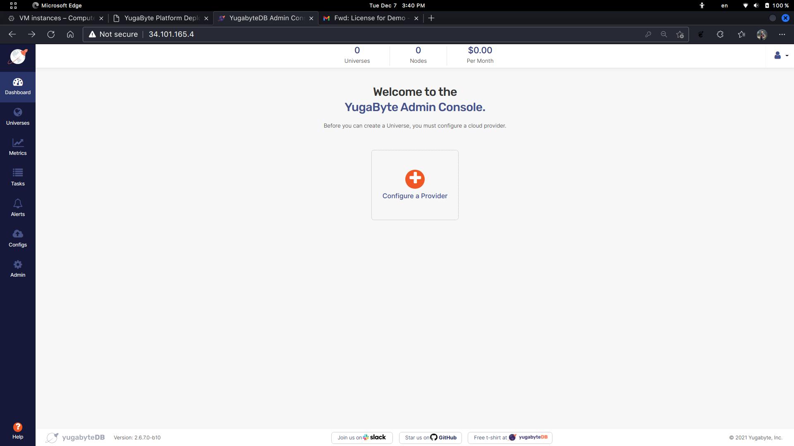

# Cloud Provider
---

Pilih ```Configure a Provider```.



---

Karena kita menggunakan **Google Cloud**, jadi kita akan menggunakan menu ***Google Cloud Platform**. Masukkan nama, upload GCP config yang sudah di-unduh saat konfigurasi key pada service account sebelumnya, **SSH Port** yang digunakan adalah ```22```. Silahkan melanjutkan dengan mengklik tombol ```Save```.


