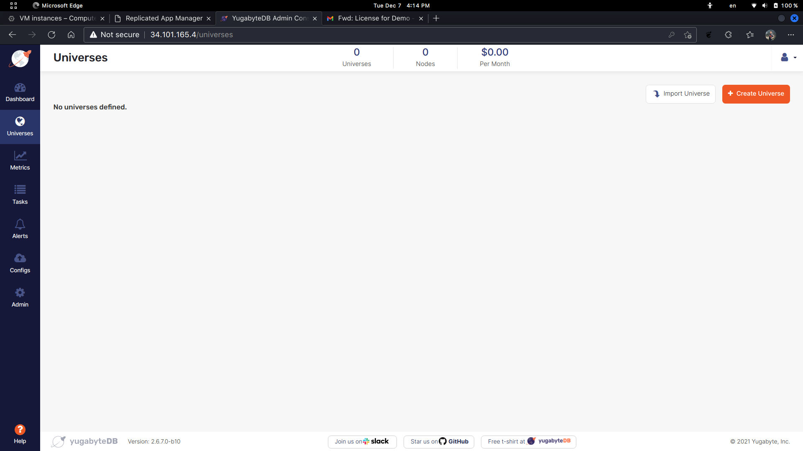
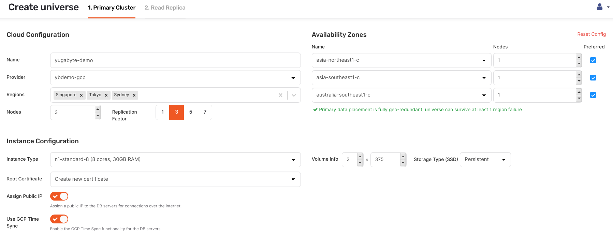
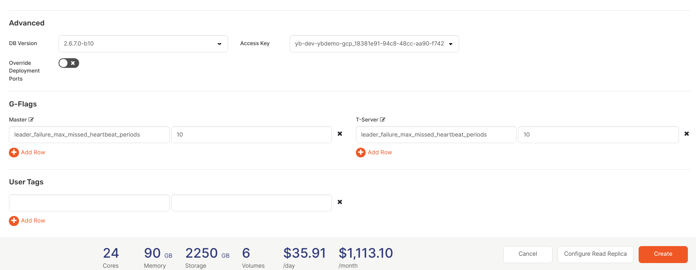
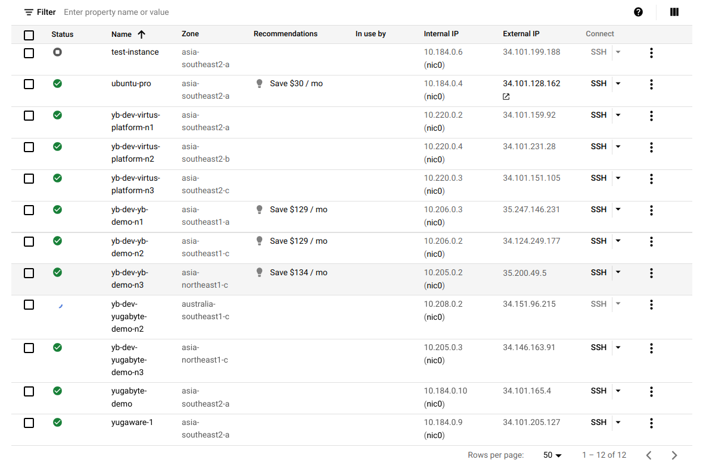
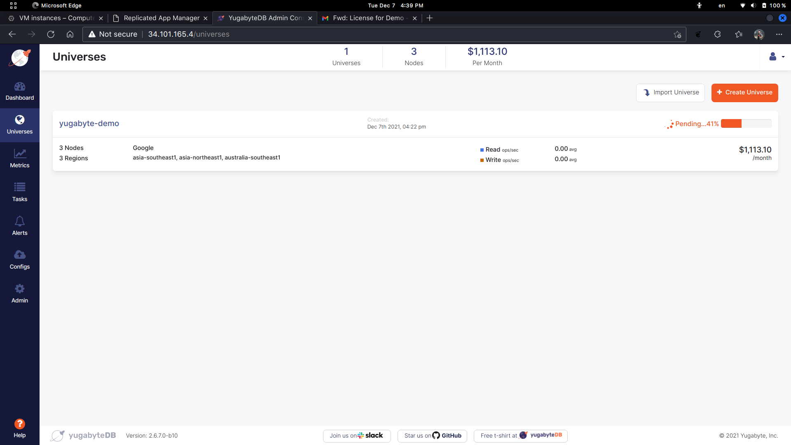
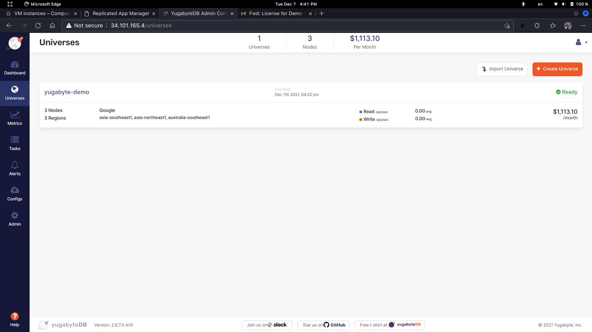

# Create Universe
---

Sekarang kita akan membuat ```Universe```. Silahkan klik tombol ```Create Universe``` pada menu **Universe**.



---

Kita akan buat **Universe** dengan nama ```yugabyte-demo```. Providernya adalah **Google Cloud Platform** yang tadi sudah kita tambahkan. Kita akan coba menerapkan konsep *geo-redundant* dengan menempatkan tiap node pada *region* yang berbeda-beda. Untuk demo kali ini kita akan membuat 3 *node* dengan mengikuti spesifikasi tiap *node* dari *virtual machine* yang sudah kita buat sebelumnya, yaitu ```n1-standard-8```. ```Volume Info``` kita buat menjadi ```2``` x ```375``` dengan *Storage Type (SSD) ```Persistent```.



Selanjutnya pada ```G-Flags``` dan ```T-Server``` kita akan menambahkan
```
leader_failure_max_missed_heartbeat_periods
```
dengan value ```10```.



Kita dapat langsung melihat simulasi biaya bulanannya di bagian bawah. Setelah selesai, silahkan klik tombol ```Create```.

---

Yugabyte akan secara otomatis membuatkan *virtual machine* untuk *host* ketiga *node* yang sudah kita konfig tadi di **Google Cloud Platform** kita.



---

Silahkan ditunggu hingga proses konfigurasi *node* selesai dilakukan.

Konfigurasi *node* akan dilakukan secara otomatis dari **Yugabyte Platform** ;)



---

Apabila status **Universes** sudah ```Ready```, maka **Yugabyte Platform** telah sukses diinstal di **Google Cloud Platform**. Yaaay

