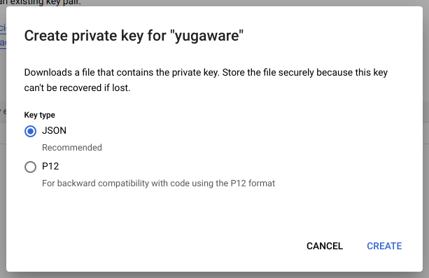

# Service Account
---

Buat *Service Account* baru di **IAM & ADMIN** dengan nama ```yugaware```


---

Selanjutnya tambah *role* baru dengan nama ```Owner``` dan ```Compute Admin```


Tujuannya agar nantinya Yugabyte dapat mengakses *virtual machine* yang kita buat

---

Tambahkan *key* baru pada *Service Account* yang baru dibuat


*Key* yang akan digunakan bertipe JSON



Key akan secara otomatis tersimpan setelah mengklik tombol create