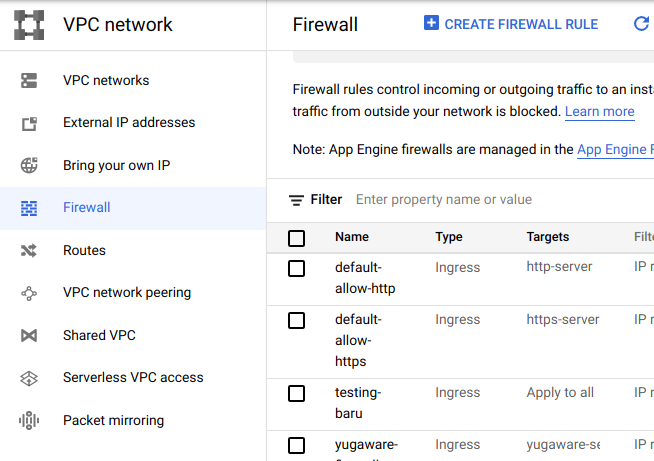
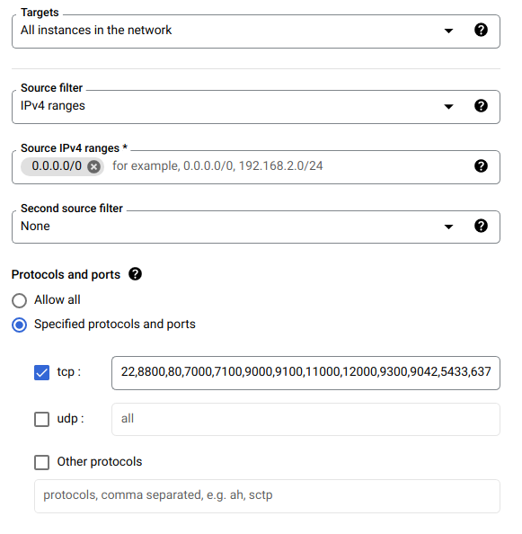

# Firewall Rule
---

Kita akan konfigurasi *firewall rule* agar *port* yang dibuka hanya *port* yang dibutuhkan Yugabyte saja.

Klik ```CREATE FIREWALL RULE```



---

Sebagai demonstrasi, nama *firewall rule* yang dibuat bernama ```firewall-demo``` dengan konfigurasi seperti berikut



Kita membuka beberapa *port* yang memang dibutuhkan Yugabyte Platform agar bisa berinteraksi antar node.

*Port* yang dibuka antara lain :
```
22,8800,80,7000,7100,9000,9100,11000,12000,9300,9042,5433,6379
```