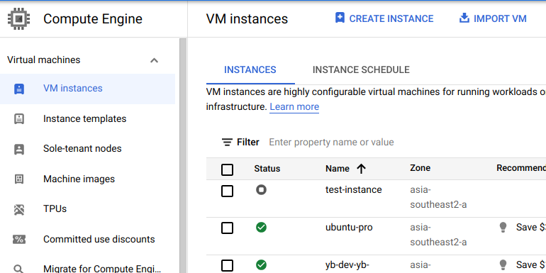

# Virtual Machine
---

Sekarang kita akan membuat *virtual machine instance* baru yang akan digunakan sebagai *host* Yugabyte Platform.

Silahkan klik ```CREATE INSTANCE``` pada **VM instances** di bagian **Compute Engine**



---

Untuk demo kali ini kita menggunakan tipe mesin ```n1-standard-8```


Boot disk yang digunakan yaitu ```Ubuntu 18.04 LTS```


Masih di konfigurasi *virtual machine*, kita akan menambahkan *IP static* yang baru di bagian *Network Interfaces*.
Fungsinya agar IP tidak berubah apabila *virtual machine* kita matikan atau *reboot*.


Silahkan klik tombol ```RESERVE``` setelah sudah diberi nama.


---

Langkah-langkah pembuatan virtual *machine sudah selesai*. Selanjutnya silahkan klik tombol ```CREATE```

