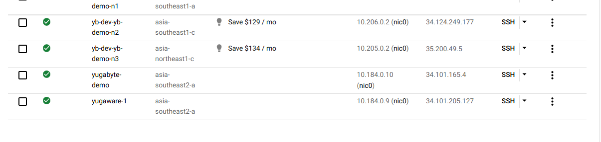

# Koneksi ke VM
---

Sekarang kita akan melakukan instalasi Yugabyte di *virtual machine* yang sudah kita buat. Pertama kita akan melakukan koneksi ke *virtual machine* menggunakan **SSH**.

Silahkan klik tombol **SSH** pada *virtual machine* yang sudah dibuat.

