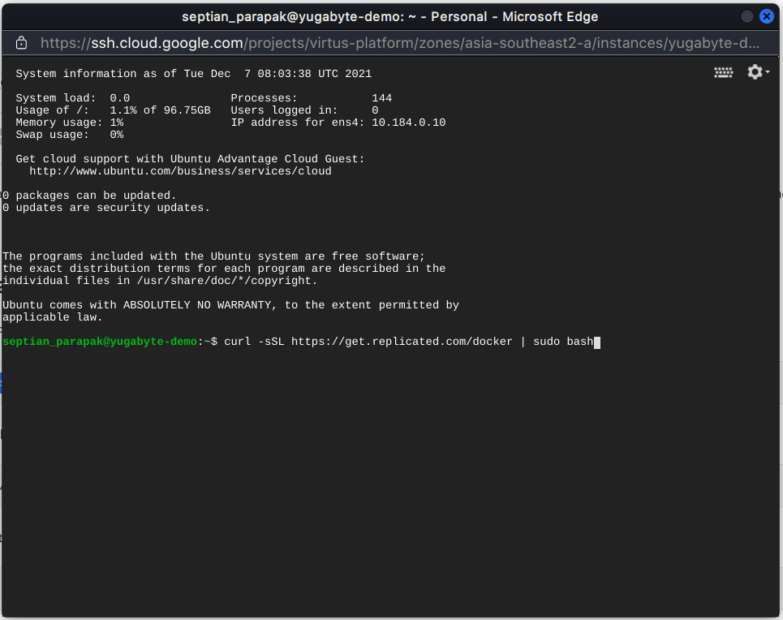
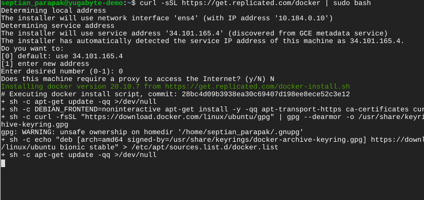
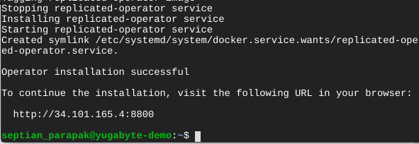

# Konfigurasi Docker
---

*Virtual machine* yang kita gunakan harus terinstal **Docker**

Pertama kita *install* **Docker** terlebih dahulu dengan perintah berikut:
```
curl -sSL https://get.replicated.com/docker | sudo bash
```




Pada demo kali ini kita akan konfigurasi **Docker** tanpa menggunakan *proxy* dan menggunakan *Default IP*.




Setelah konfigurasi berhasil dilakukan, URL akan tampil dan konfigurasi selanjutnya akan dilakukan di URL tersebut.

