# Konfigurasi Dashboard
---

Berikut ini adalah tampilan awal dari *dashboard*. Masih kosong karena Yugabyte Platform belum diinstal di dalamnya.

Silahkan klik ```Continue to Setup```

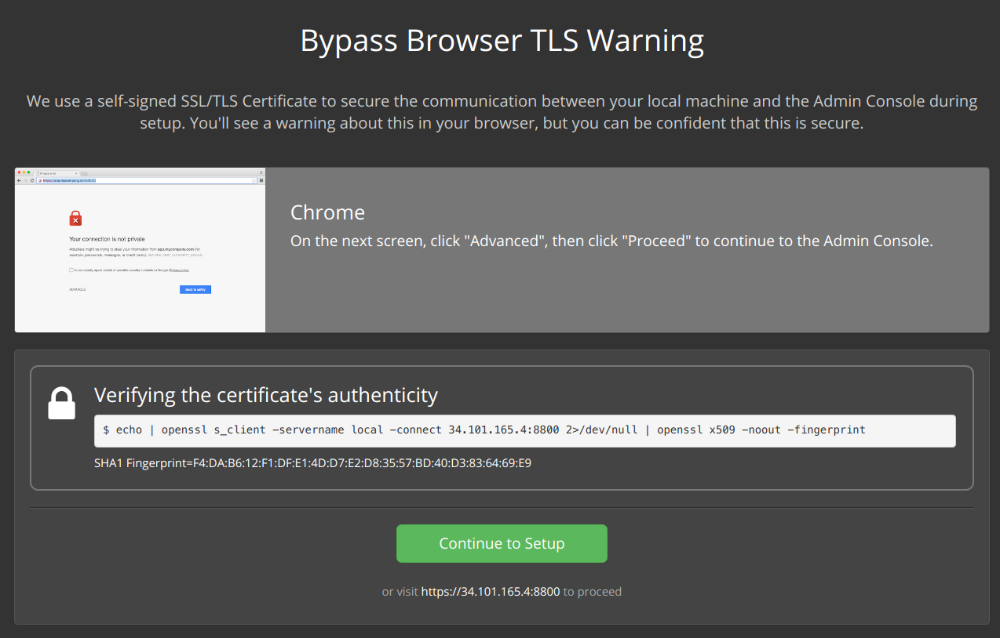

---

Karena ini hanya demonstrasi, kita tidak akan konfigurasi custom SSLnya. Silahkan melanjutkan dengan klik tombol ```Use Self-Signed Cert``` dan dilanjutkan dengan ```Continue without a hostname```.

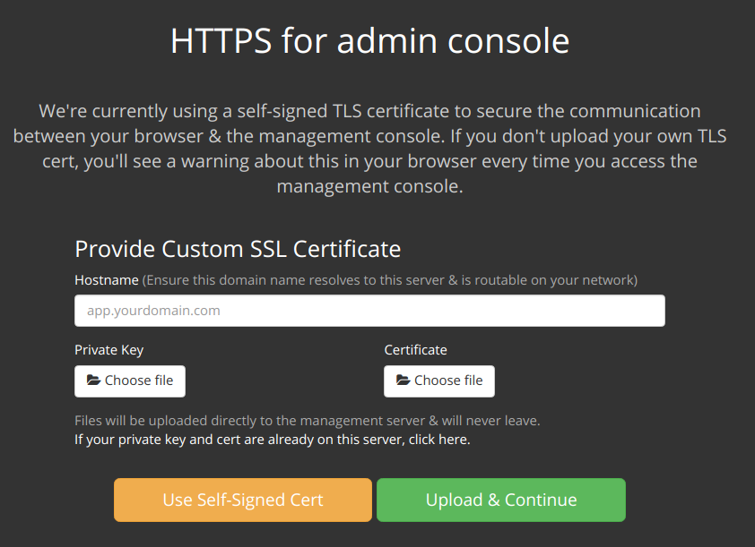

---

Silahkan unggah lisensi Yugabyte Platform yang kalian miliki. Apabila kalian belum memiliki lisensi Yugabyte Platform, bisa menghubungi tim Virtus di yugabyte@virtusindonesia.com untuk mendapatkannya.

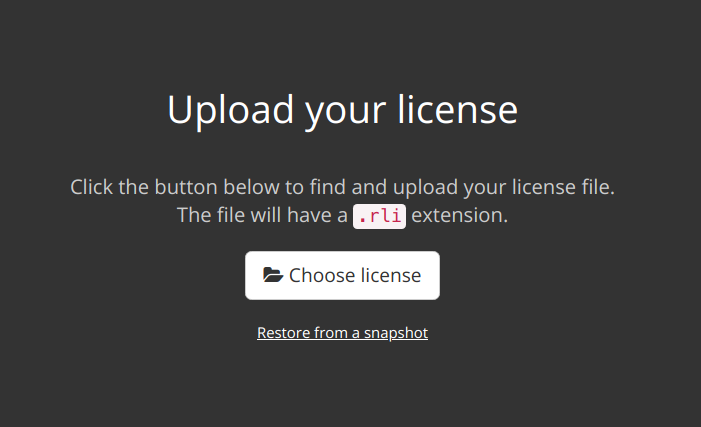

---

Karena kita melakukan installasi ke **Google Cloud Platform**, jadi kita akan melanjutkan dengan tombol ```Online```. Menu **Airgapped** digunakan apabila kita melakukan instalasi diatas **Kubernetes**.

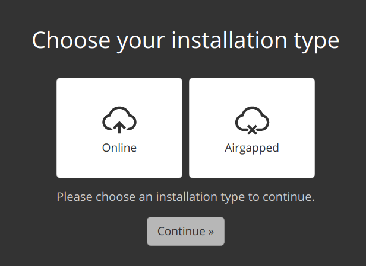

---

Kita menggunakan versi bawaan yaitu ```2.6-Stable```. Silahkan melanjutkan dengan mengklik tombol ```Continue with 2.6-Stable release```.

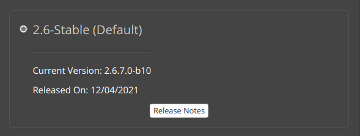

---

Silahkan masukkan password untuk Admin Console

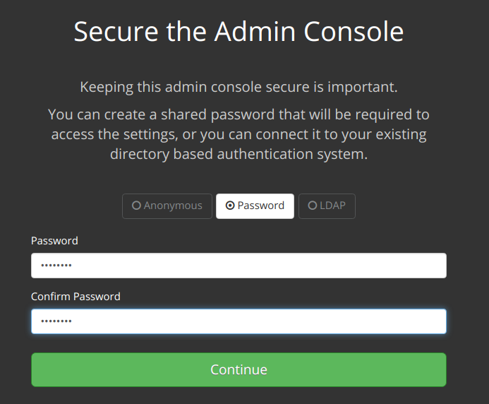

---

Selanjutnya konfigurasi akan diperiksa terlebih dahulu. Apabila tidak ada masalah, silahkan klik tombol ```Continue```

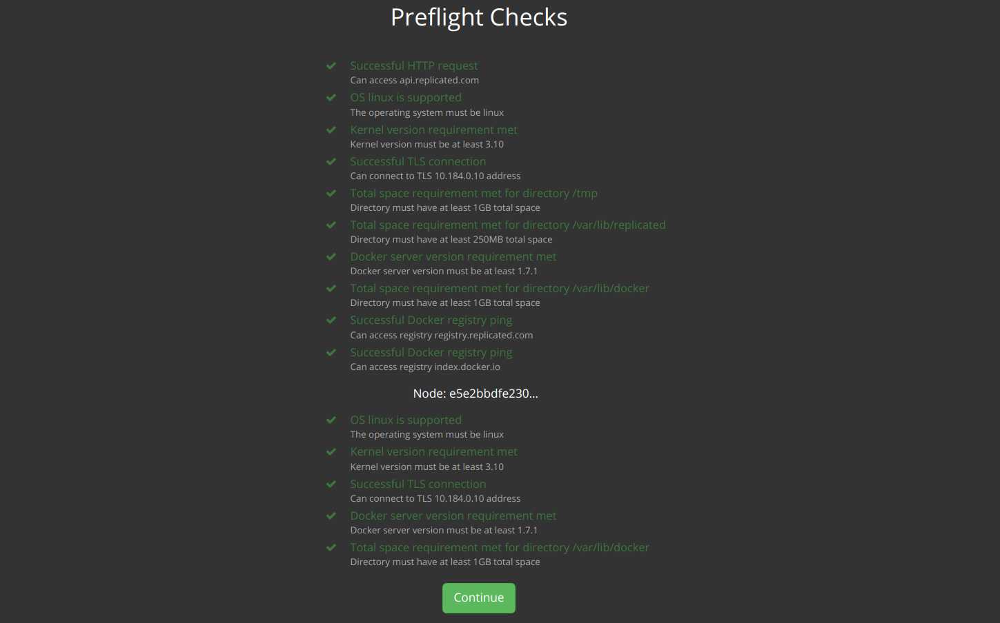

---

Kita akan menggunakan *default setting*. Silahkan periksa versi TLS terlebih dahulu dengan mengklik tombol 
```Check TLS version list is valid```. Apabila berhasil, silahkan di-save lalu pilih ```Restart Now```

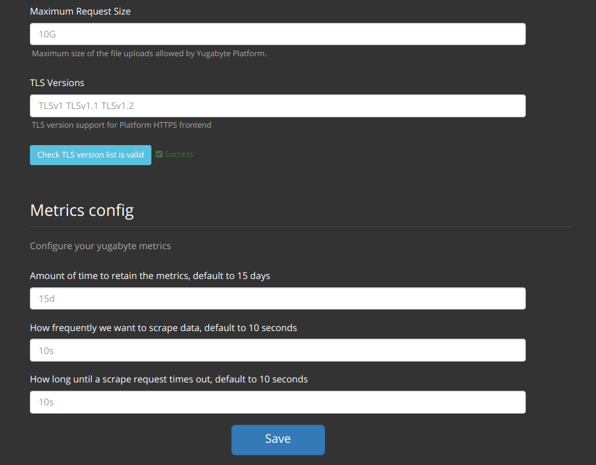

---

Apabila komponen sudah menjadi ```Started```, silahkan pilih ```Open``` untuk membuka *dashboard* Yugabyte.

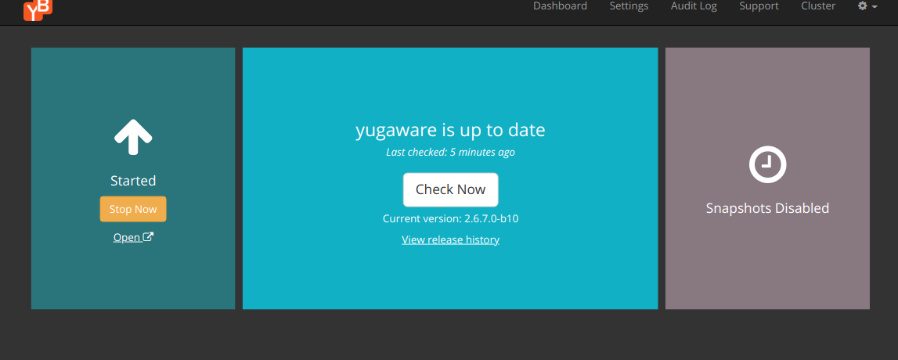

---

Silahkan masukkan informasi yang digunakan untuk masuk ke *dashboard* **Yugabyte Platform**. Untuk demo ini kita akan menggunakan *Environment* ```dev```.

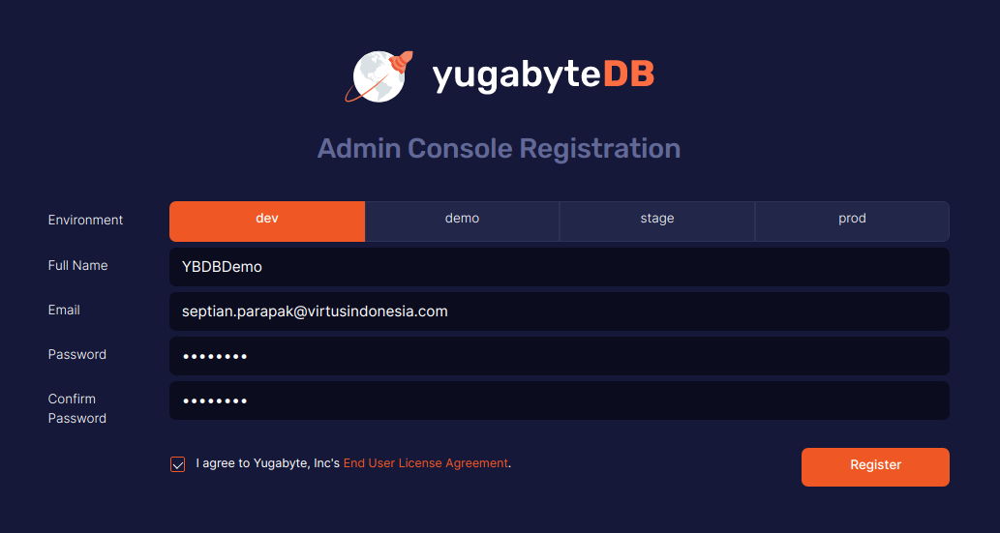


Setelah itu, silahkan klik tombol ```Register```.

---

Kamu dapat login menggunakan *credential* yang baru saja dibuat.

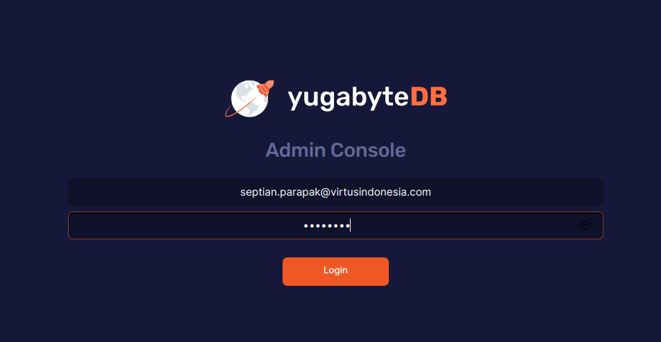

---

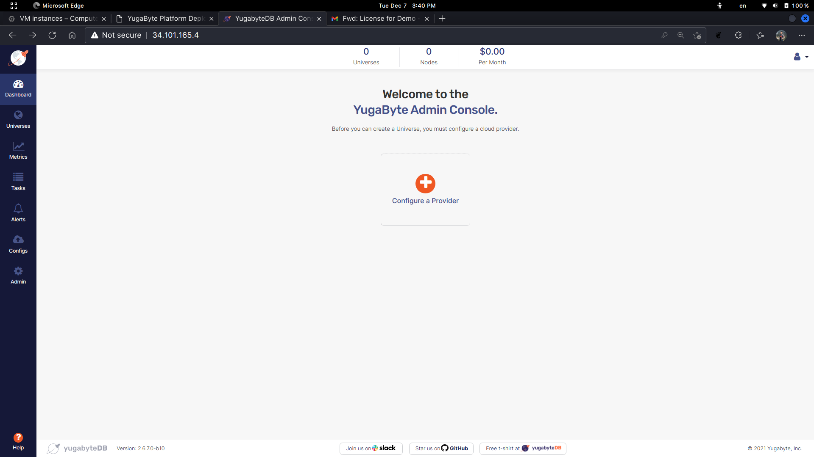

Sudah selesai? Belum. Kita harus tambahkan *provider* yang akan digunakan untuk node-node yang Yugabyte Platform pakai nantinya.