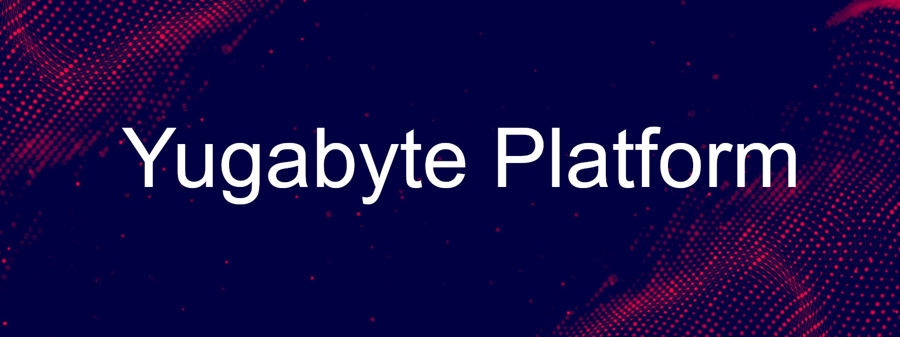

# Yugabyte Platform

Cara installasi Yugabyte Platform **(YBPlatform)** di Google Cloud Platform **(GCP)**.

Konfigurasi Yugabyte Platform kali ini kita akan menerapkan konsep Geo-Redundant dengan cara
menempatkan tiap virtual machine yang sudah dikonfigurasi sebagai node di region yang berbeda.
